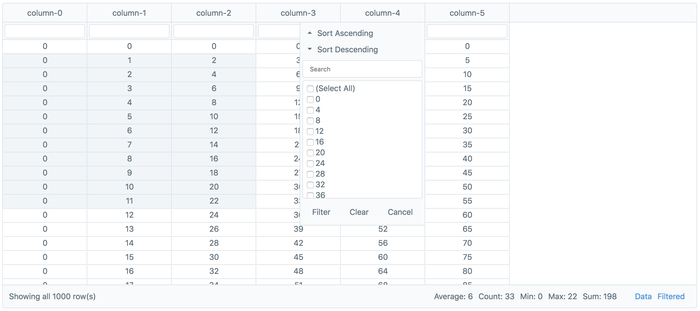

# vue-slimgrid

## Installation
```sh
npm i vue-slimgrid --save
yarn add vue-slimgrid
```



## Example.vue
```html

<style src="../node_modules/vue-slimgrid/dist/slimgrid.css"></style>

<template>
    <slim-grid :data="data" :column-options="columnOptions"></slim-grid>
</template>

<script>
import SlimGrid from 'vue-slimgrid';

export default {
  components: { SlimGrid },
  data() => ({
      data: [],
      columnOptions: {}
  }),
  mounted() {
    this.generateDummyData();
  },
  methods: {
    generateDummyData() {
      var data = [];
      for (var i = 0; i < 1000; i++) {
        var row = { id: i };
        for (var j = 0; j < 6; j++) {
          row["column-" + j] = i * j;
        }
        data.push(row);
      }
      this.data = data;
    }
  }
}
</script>

```

## Development

### Compiles and Hot-Reloads
```
cd ./examples
vue serve
```
